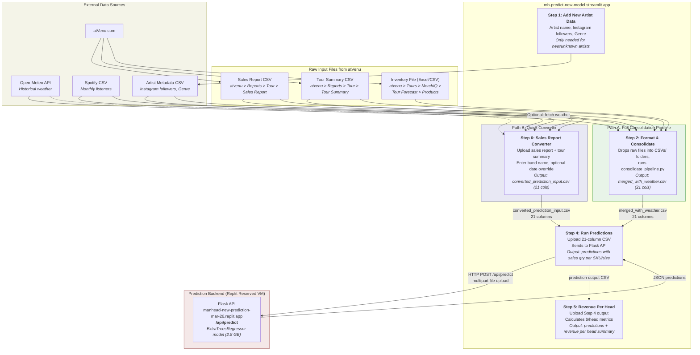

# New Prediction Model Flow



## 21-Column Prediction Input Format
Both Path A and Path B produce a CSV with these columns:

```
artistName, Genre, showDate, HolidayStatus, venue name, venue city,
venue state, venue country, venue postalCode, merch category, productType,
product size, attendance, product price, temperature_daily_mean, rain,
snowfall, spotifyMonthlyListeners, Instagram, venue capacity, spotifyMissing
```

## Quick Reference

| Path | When to Use | Input Files | Enrichment |
|------|-------------|-------------|------------|
| **Path A** (Step 2) | Bulk processing, full enrichment | Inventory + Sales Reports + Tour Summary dropped into CSVs/ folders | Real weather, Spotify, Instagram from files |
| **Path B** (Step 6) | Quick single-show conversion | Sales Report CSV + Tour Summary CSV uploaded directly | Default weather (15C, no rain) unless checkbox enabled |
