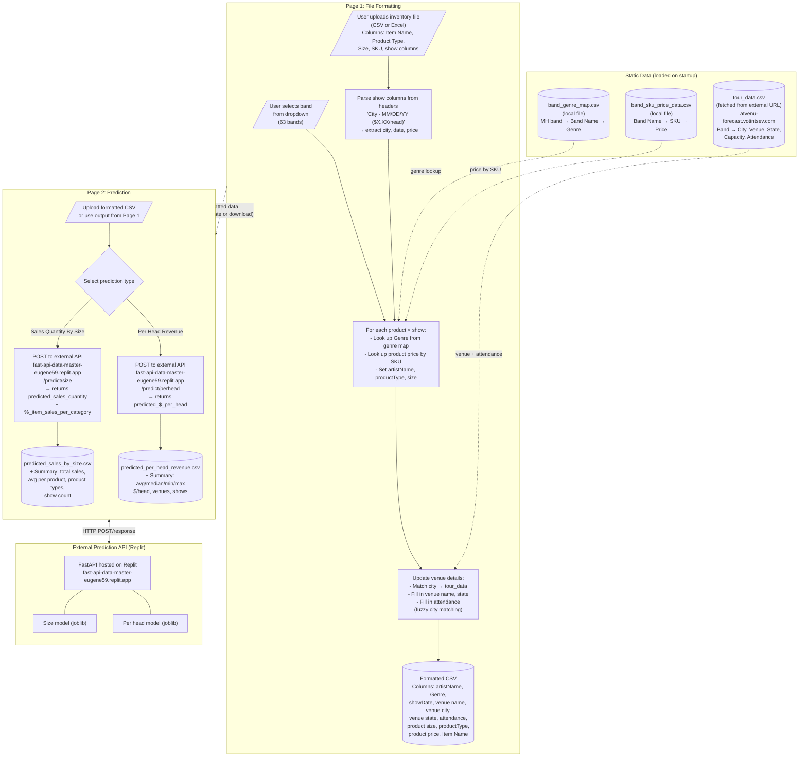
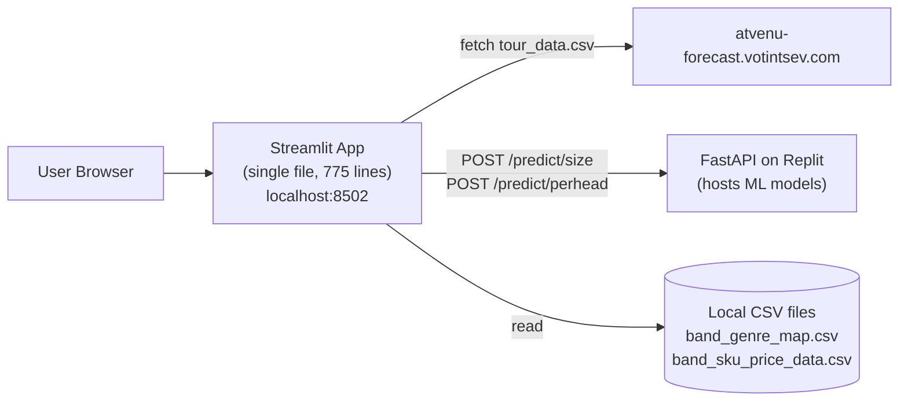

# Old Model (Current Production) - Data Flow

## High-Level Pipeline

## Workflow Summary

### Page 1: File Formatting
1. User selects a band from the dropdown (63 Manhead bands)
2. User uploads an inventory file (CSV/Excel) with show columns in headers
3. System parses show dates/cities from column headers like `"Hershey - 11/08/24 ($7.00/head)"`
4. For each product row x show: builds a record with genre, SKU-based price, venue details
5. Venue name, state, and attendance are matched from external tour data via city name
6. Output: formatted CSV ready for prediction

### Page 2: Prediction
1. User uploads formatted CSV (or carries forward from Page 1)
2. User chooses prediction type:
   - **Sales Quantity By Size**: predicts units sold per product/size/show
   - **Per Head Revenue**: predicts $/head per show
3. Data is sent to an external FastAPI on Replit
4. Results returned with predictions + summary stats

## Architecture

## Key Differences vs New Ashling Model

| Aspect | Old (This App) | New (Ashling) |
|--------|---------------|---------------|
| Prediction API | External Replit FastAPI | Local Flask on port 5000 |
| Model algorithm | Unknown (hosted externally) | ExtraTreesRegressor (2000 trees) |
| Model size | Unknown (remote) | ~2.9 GB joblib |
| Training data | Unknown (remote) | ~45,800 rows, retrainable |
| Weather data | Not used in formatting | Temperature, rain, snowfall |
| Social data | Not used in formatting | Spotify listeners, Instagram |
| Holiday awareness | No | Yes (US holidays + weekends) |
| Venue geocoding | No | Yes (ZIP → lat/lon) |
| Two prediction types | Size + Per Head (separate) | Size only (Per Head as Step 5) |
| Tour data source | External URL | Local CSV files |
| Price lookup | SKU-based from local CSV | Included in input CSV |
| Retraining | Not possible (remote model) | Built-in Step 3 |
| Data consolidation | Manual formatting only | Automated 5-step pipeline |
